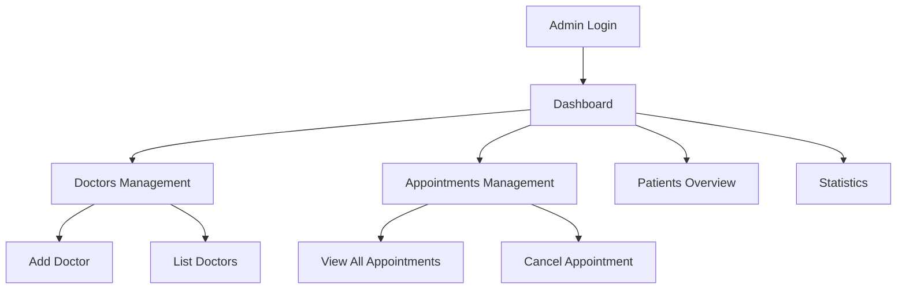

# MeroDoctor Admin Panel


## Overview

The **MeroDoctor Admin Panel** is a modern, responsive web application for managing doctors, appointments, and patients in the MeroDoctor healthcare platform. It provides administrators with tools to add and manage doctors, view and control appointments, and monitor platform statistics in real time.

---

## Features

- **Admin Authentication**: Secure login for admin users.
- **Doctor Management**: Add, list, and update doctor profiles and availability.
- **Appointment Management**: View, filter, and cancel patient appointments.
- **Dashboard**: Real-time statistics for doctors, patients, and appointments.
- **Responsive UI**: Clean, mobile-friendly design using Tailwind CSS.
- **Notifications**: User feedback via toast notifications.

---

## Tech Stack

- **Frontend Framework**: React.js (with Context API)
- **Routing**: React Router
- **Styling**: Tailwind CSS
- **HTTP Client**: Axios
- **Notifications**: React Toastify
- **Build Tool**: Vite

---

## Folder Structure

```
admin/
├── public/
├── src/
│   ├── assets/           # Images and SVGs
│   ├── components/       # Navbar, Sidebar, etc.
│   ├── context/          # React Context Providers
│   ├── pages/            # Page Components (Dashboard, Doctors, etc.)
│   ├── App.jsx           # Main App Component
│   ├── main.jsx          # Entry Point
│   └── ...
├── package.json
├── vite.config.js
└── README.md
```

---

## System Architecture



---

## Getting Started

### Prerequisites

- Node.js (v18+ recommended)
- npm or yarn

### Installation

1. **Clone the repository:**
   ```sh
   git clone <your-repo-url>
   cd MeroDoctor/admin
   ```
2. **Install dependencies:**
   ```sh
   npm install
   # or
   yarn install
   ```
3. **Configure environment variables:**

   - Create a `.env` file if needed (see `.env.example` or Vite docs).
   - Set `VITE_BACKEND_URL` to your backend server URL.

4. **Run the development server:**

   ```sh
   npm run dev
   # or
   yarn dev
   ```

5. **Open in browser:**
   - Visit [http://localhost:5173](http://localhost:5173) (or the port shown in your terminal).

---

## Key Scripts

- `npm run dev` — Start development server
- `npm run build` — Build for production
- `npm run preview` — Preview production build

---

## Environment Variables

- `VITE_BACKEND_URL` — URL of the backend API server (e.g., `http://localhost:4000`)

---

## Contributing

Pull requests are welcome! For major changes, please open an issue first to discuss what you would like to change.

---

## License

This project is licensed under the MIT License.

---

## Contact

For questions or support, please contact the project maintainer.

---

## Acknowledgements

- [React](https://react.dev/)
- [Tailwind CSS](https://tailwindcss.com/)
- [Vite](https://vitejs.dev/)
- [React Toastify](https://fkhadra.github.io/react-toastify/)
- [Axios](https://axios-http.com/)
