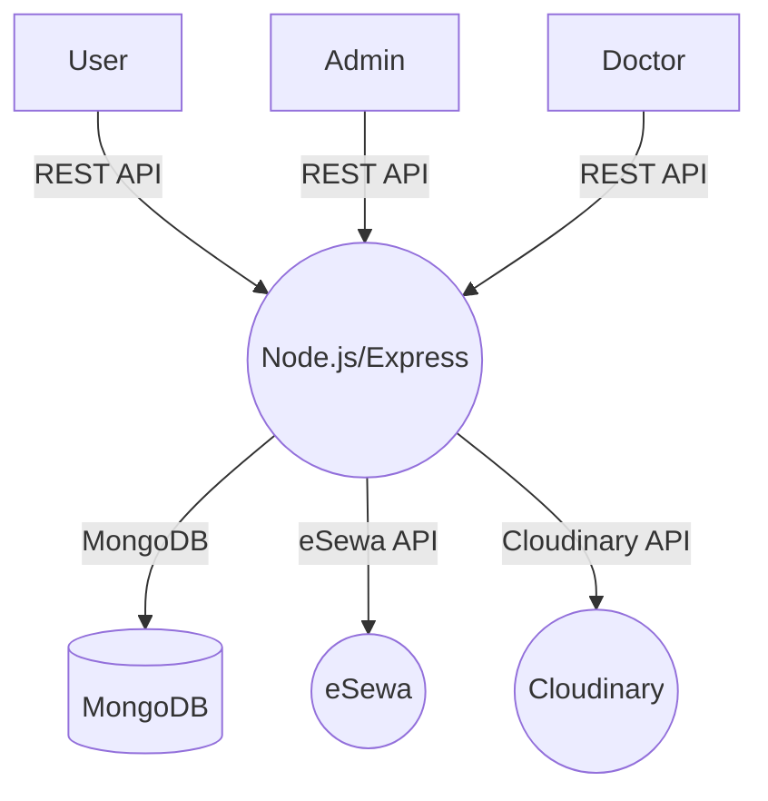

# MeroDoctor Backend


## Overview

MeroDoctor is a full-stack web application designed to streamline doctor-patient interactions, appointment bookings, and online payments. This backend is built with Node.js, Express, and MongoDB, and provides RESTful APIs for user, doctor, admin, and payment operations. It also integrates with eSewa for secure online payments and Cloudinary for image uploads.

---

## Features

- **User Registration & Authentication** (JWT-based)
- **Doctor Management** (Admin panel)
- **Appointment Booking & Management**
- **Online Payment Integration** (eSewa)
- **Profile Management** (with Cloudinary image uploads)
- **Admin Dashboard** (doctors, appointments, patients overview)
- **Role-based Access Control**
- **RESTful API Design**

---

## Tech Stack

| Layer        | Technology              |
| ------------ | ----------------------- |
| Backend      | Node.js, Express        |
| Database     | MongoDB, Mongoose       |
| Auth         | JWT                     |
| File Uploads | Multer, Cloudinary      |
| Payments     | eSewa API               |
| Validation   | Validator, Custom Regex |
| Environment  | dotenv                  |

---

## Project Structure

```bash
backend/
├── config/           # Database & Cloudinary config
├── controllers/      # Route controllers (business logic)
├── middlewares/      # Auth, file upload, etc.
├── models/           # Mongoose schemas
├── routes/           # Express routers
├── server.js         # Entry point
└── .env              # Environment variables
```

---

## API Endpoints

### User

- `POST   /api/user/register` — Register a new user
- `POST   /api/user/login` — User login
- `GET    /api/user/get-profile` — Get user profile
- `POST   /api/user/update-profile` — Update user profile
- `POST   /api/user/book-appointment` — Book appointment
- `GET    /api/user/appointments` — List user appointments
- `POST   /api/user/cancel-appointment` — Cancel appointment
- `POST   /api/user/get-payment-details` — Get payment details

### Doctor

- `GET    /api/doctor/list` — List all doctors
- `POST   /api/doctor/login` — Doctor login
- `POST   /api/doctor/appointments` — Get doctor appointments
- `GET    /api/doctor/profile/:doctorId` — Get doctor profile
- `PUT    /api/doctor/profile/:doctorId` — Update doctor profile

### Admin

- `POST   /api/admin/login` — Admin login
- `POST   /api/admin/add-doctor` — Add new doctor
- `POST   /api/admin/update-doctor/:doctId` — Update existing doctor
- `POST   /api/admin/all-doctors` — List all doctors
- `POST   /api/admin/change-availability` — Change doctor availability
- `GET    /api/admin/appointments` — List all appointments
- `POST   /api/admin/cancel-appointment` — Cancel appointment
- `GET    /api/admin/dashboard` — Dashboard data

### Payment

- `POST   /api/payment/esewa/initiate-payment` — Initiate eSewa payment
- `GET    /api/payment/esewa/esewaVerification` — Verify eSewa payment
- `GET    /api/payment/esewa/success` — Payment success callback
- `GET    /api/payment/esewa/failure` — Payment failure callback

---

## Environment Variables

Create a `.env` file in the backend root with the following:

```env
PORT=4000
MONGODB_URI=your_mongodb_uri
JWT_SECRET=your_jwt_secret
CLOUDINARY_CLOUD_NAME=your_cloudinary_name
CLOUDINARY_API_KEY=your_cloudinary_key
CLOUDINARY_API_SECRET=your_cloudinary_secret
ESEWA_PRODUCT_CODE=EPAYTEST
ESEWA_SECRET_KEY=your_esewa_secret
ESEWA_BASE_URL=https://rc-epay.esewa.com.np/api/epay/main/v2/form
FRONTEND_URL=http://localhost:5173
ADMIN_EMAIL=admin@example.com
ADMIN_PASSWORD=your_admin_password
```

---

## Test Credentials

For development and testing purposes, you can use the following test doctor account:

- **Email**: doctor@test.com
- **Password**: doctor123

To create this test account, run:
```bash
node seedDoctor.js
```

---

## Getting Started

1. **Install dependencies:**
   ```bash
   npm install
   ```
2. **Set up your `.env` file** (see above)
3. **Start the server:**
   ```bash
   npm run dev
   ```
4. **API will be available at** `http://localhost:4000`

---

## Useful Diagrams

### System Architecture



---

## License

This project is licensed under the MIT License.
