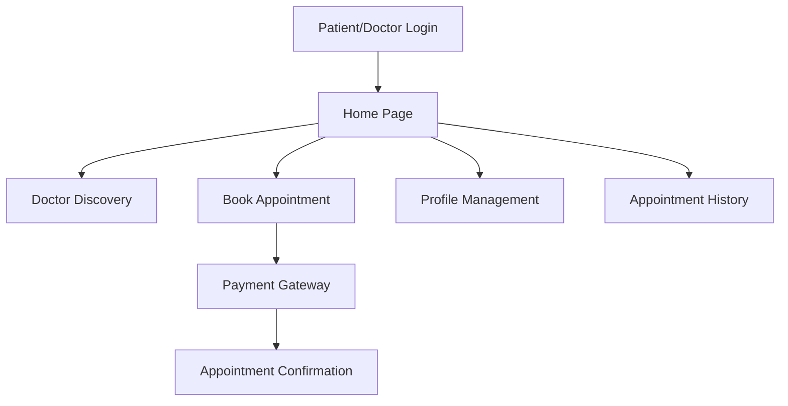

# MeroDoctor Frontend


## Overview

The **MeroDoctor Frontend** is a modern, user-friendly web application for patients and doctors to interact, book appointments, and manage healthcare needs. It is the main user-facing portal of the MeroDoctor platform, providing seamless appointment booking, doctor discovery, and patient management features.

---

## Features

- **Patient Registration & Login**: Secure authentication for patients.
- **Doctor Discovery**: Browse and search doctors by speciality, experience, and location.
- **Appointment Booking**: Book, view, and manage appointments with doctors.
- **Payment Integration**: Secure online payments for appointments (eSewa, Stripe, etc.).
- **Profile Management**: Patients can update their profile and view appointment history.
- **Responsive UI**: Mobile-friendly, clean design using Tailwind CSS.
- **Notifications**: Real-time feedback and alerts via toast notifications.

---

## Tech Stack

- **Frontend Framework**: React.js (with Context API)
- **Routing**: React Router
- **Styling**: Tailwind CSS
- **HTTP Client**: Axios
- **Notifications**: React Toastify
- **Build Tool**: Vite

---

## Folder Structure

```
frontend/
├── public/
├── src/
│   ├── assets/           # Images and SVGs
│   ├── components/       # Reusable UI components
│   ├── context/          # React Context Providers
│   ├── pages/            # Page Components (Home, Doctors, etc.)
│   ├── App.jsx           # Main App Component
│   ├── main.jsx          # Entry Point
│   └── ...
├── package.json
├── vite.config.js
└── README.md
```

---

## System Architecture



---

## Getting Started

### Prerequisites

- Node.js (v18+ recommended)
- npm or yarn

### Installation

1. **Clone the repository:**
   ```sh
   git clone <your-repo-url>
   cd MeroDoctor/frontend
   ```
2. **Install dependencies:**
   ```sh
   npm install
   # or
   yarn install
   ```
3. **Configure environment variables:**

   - Create a `.env` file if needed (see `.env.example` or Vite docs).
   - Set `VITE_BACKEND_URL` to your backend server URL.

4. **Run the development server:**

   ```sh
   npm run dev
   # or
   yarn dev
   ```

5. **Open in browser:**
   - Visit [http://localhost:5173](http://localhost:5173) (or the port shown in your terminal).

---

## Key Scripts

- `npm run dev` — Start development server
- `npm run build` — Build for production
- `npm run preview` — Preview production build

---

## Environment Variables

- `VITE_BACKEND_URL` — URL of the backend API server (e.g., `http://localhost:4000`)

---

- [React](https://react.dev/)
- [Tailwind CSS](https://tailwindcss.com/)
- [Vite](https://vitejs.dev/)
- [React Toastify](https://fkhadra.github.io/react-toastify/)
- [Axios](https://axios-http.com/)
